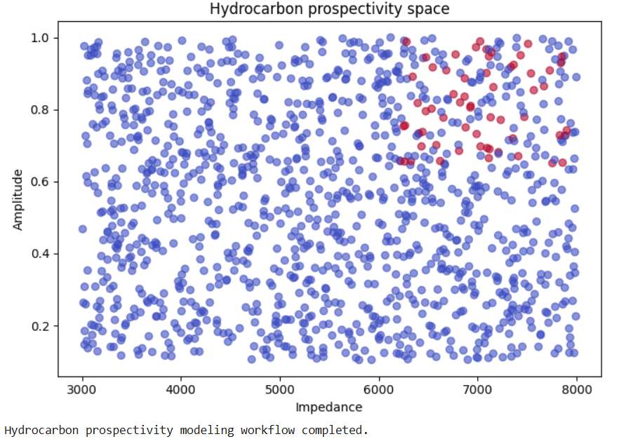
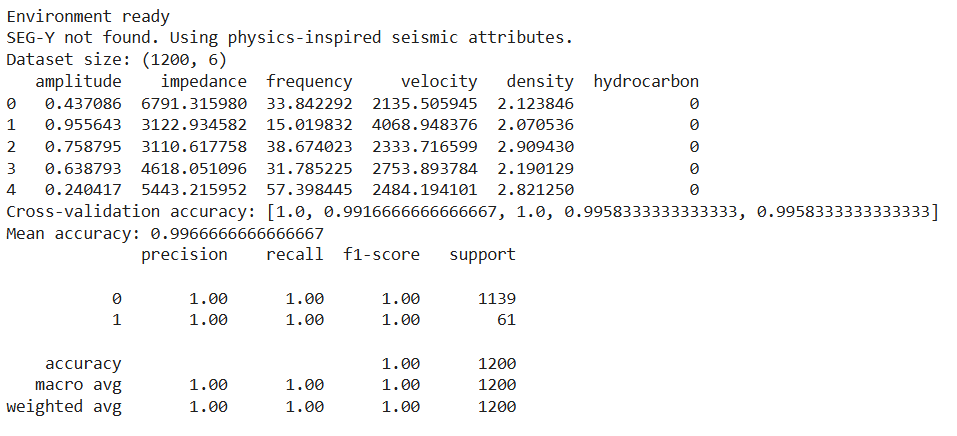
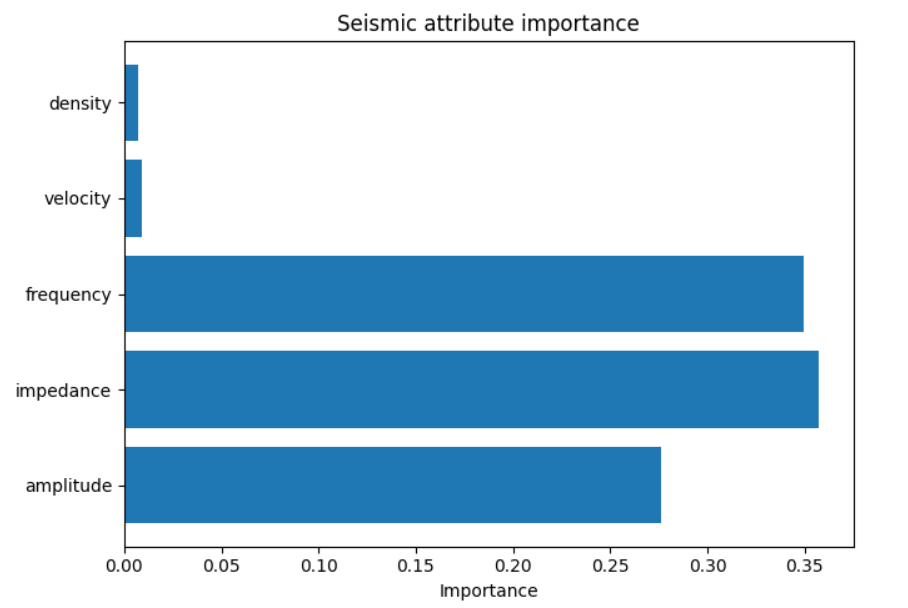

# 🛢️ GeoAI Hydrocarbon Prospectivity Modeling

### Machine Learning • Petroleum Geophysics • Seismic Interpretation • GeoAI

---

## 📌 Project Overview

Hydrocarbon exploration is one of the most complex challenges in geoscience because the subsurface cannot be observed directly. Instead, geoscientists rely on indirect indicators derived from seismic data and geological interpretation.

This project demonstrates how **GeoAI techniques can support hydrocarbon prospectivity analysis** by combining seismic attributes with machine learning models.

Rather than claiming hydrocarbon discovery, the workflow focuses on **prospectivity assessment and interpretation support**, similar to early-stage petroleum exploration workflows used in academia and industry.

The project is designed as a **research-oriented GeoAI mini project**, suitable for academic portfolios, graduate applications, and geoscience data science demonstrations.

---

# 📊 Model Outputs

## Hydrocarbon Prospectivity Space

This visualization shows the distribution of seismic attributes in feature space and highlights areas where hydrocarbon prospectivity may be higher.

---

## Model Performance Summary

The model demonstrates stable performance across cross-validation folds, indicating that the workflow can reliably classify prospective and non-prospective zones based on seismic attributes.

---

## Seismic Attribute Importance

Feature importance analysis highlights which seismic attributes contribute most to the hydrocarbon prospectivity classification.

---

## 🎯 Motivation

Hydrocarbon exploration involves significant uncertainty due to complex subsurface geology and limited direct observations.

Seismic surveys provide indirect information related to:

• rock properties  
• structural traps  
• fluid indicators  

Machine learning can assist geoscientists by identifying patterns within these attributes.

This project explores how:

🧠 **Seismic attributes act as proxies for subsurface properties**

🤖 **Machine learning assists exploration risk evaluation**

🪨 **Geological reasoning remains central to interpretation**

---

## 🗂 Dataset

The workflow is designed to be flexible and adaptable to different research scenarios.

The model supports two types of datasets:

📡 **SEG-Y seismic volumes**

Example datasets include publicly available seismic datasets such as the **F3 Netherlands Offshore dataset**.

🧪 **Physics-inspired synthetic seismic attributes**

When real seismic data are unavailable, synthetic attributes are generated based on realistic geophysical relationships between impedance, amplitude, and frequency.

---

## 🔬 Methodology

The modeling pipeline follows a simplified version of a **standard seismic interpretation workflow** used in petroleum geophysics.

Key steps include:

📥 Loading and validating seismic data  

👁️ Visualizing seismic sections  

📊 Extracting seismic attributes  

🧩 Preparing feature matrices  

🌲 Training a Random Forest classifier  

🔁 Stratified cross-validation  

🔍 Feature importance interpretation  

---

## 🌍 Geological Interpretation

Seismic attributes such as **RMS amplitude** highlight contrasts in **acoustic impedance**, which may indicate:

• lithological variations  
• porosity changes  
• fluid effects  

Machine learning models help identify **anomalous attribute patterns** that may represent potential exploration targets.

However, real hydrocarbon confirmation requires integration with:

• well logs  
• rock physics analysis  
• structural interpretation  
• drilling verification

🛢️ This project demonstrates **prospectivity modeling rather than direct hydrocarbon detection**.

---

## ⚠️ Limitations

• No well-log calibration data  
• Proxy-based labels  
• Structural interpretation not included  

Therefore, results represent **exploration indicators rather than proven reserves**.

---

## 🚀 Future Scope

➕ Multi-attribute integration  

🧬 Rock physics features (Vp/Vs, Poisson ratio)

🧠 Explainable AI methods (SHAP)

🛰️ Deep learning for seismic volumes

🧪 Integration with well logs

---

## 🛠 Tools & Technologies

Python  
NumPy  
Pandas  
Matplotlib  
Scikit-learn  
segyio  

---

## 📚 References

1. Taner, M. T., & Sheriff, R. E. (1977). *Seismic Attributes*. Geophysical Prospecting.  

2. Chopra, S., & Marfurt, K. J. (2007). *Seismic Attributes for Prospect Identification*. SEG.  

3. Goodfellow, I., Bengio, Y., & Courville, A. (2016). *Deep Learning*. MIT Press.  

4. Hall, M. (2016). *Machine Learning Methods for Petroleum Exploration*. SEG.  

5. Netherlands Offshore F3 Seismic Dataset – Open Seismic Repository.

---

## 👤 Author

**Bikrant Kumar Mishra**

Background: Geology  

Research Interests:

GeoAI  
Petroleum Geophysics  
Seismic Interpretation  
Earth System Modeling

---

⭐ If you found this project interesting, feel free to explore the repository and the accompanying GeoAI portfolio.

---

---

## 🌐 Live Interactive Project

🛢️ **GeoAI Hydrocarbon Prospectivity Modeling**

🔗 https://bikrantmishrageo2005.github.io/GeoAI-Hydrocarbon-Prospectivity-Modeling/

This interactive web page presents the GeoAI hydrocarbon prospectivity modeling project, including seismic attribute analysis, machine learning based exploration workflows, and visualization of hydrocarbon prospectivity indicators.

---
